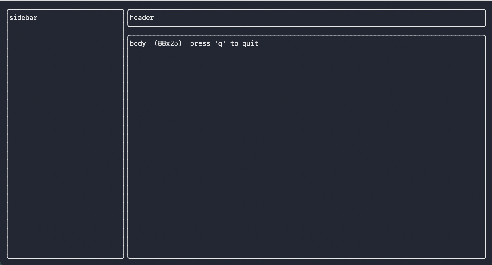

# Zest

Declarative, high-level TUI framework for Zig — comptime layouts, zero heap per frame.

> **Status: Pre-alpha. Active development. Not ready for production use.**

---

## What is Zest?

Zest is a TUI framework for Zig that lets you build rich, beautiful terminal applications without writing layout math or touching terminal escape sequences. It sits above [`libvaxis`](https://github.com/rockorager/libvaxis) and handles everything between raw terminal I/O and your application logic.

The goal is to give Zig developers what Textual gives Python developers — a productive, expressive way to build terminal UIs with a clean component model, a design token styling system, and predictable performance.

---

## Core Ideas

### Comptime Panel Layouts

The structure of your screen — which panels go where — is declared as nested anonymous structs and validated at compile time. No layout math. No coordinate arithmetic. The framework resolves panel positions at render time using the actual terminal dimensions.

### Widgets Own Their State

Widgets are structs with explicit state — scroll position, cursor, selection index. Application data (the items a list displays, the rows a table renders) is passed in at draw time. This keeps widgets reusable and keeps your data model in control.

### Design Token Styling

Colors and text styles are expressed as named tokens (`primary`, `danger`, `surface`, `muted`) rather than raw color codes. A theme maps tokens to concrete terminal colors at render time. Invalid token usage fails at compile time.

### Single-Threaded First

Zest uses a straightforward single-threaded event loop: read event → update state → render. This makes the execution model easy to reason about and debug. Threading is planned as an opt-in feature after v1.0.

### Zero Heap Per Frame

All memory allocated during a render pass lives in a frame-scoped arena that is reset at the start of each frame. No per-frame heap fragmentation. No GC pressure.

---

## Demo



---

## Quick Start

Declare your screen layout once as a comptime blueprint — Zest resolves panel positions from the actual terminal dimensions at render time:

```zig
const layout = zest.box(.{
    .direction = .horizontal,
    .children = &.{
        zest.slot(.{ .id = "sidebar", .size = .{ .fixed = 30 }, .border = true }),
        zest.box(.{
            .size      = .{ .fraction = 1 },
            .direction = .vertical,
            .children  = &.{
                zest.slot(.{ .id = "header", .size = .{ .fixed = 3 },    .border = true }),
                zest.slot(.{ .id = "body",   .size = .{ .fraction = 1 }, .border = true }),
            },
        }),
    },
});
```

On each resize, call `Box.windows()` to get a named struct of sub-windows — one field per slot, no index arithmetic:

```zig
fn update(state: *State, event: zest.Event, win: vaxis.Window, alloc: std.mem.Allocator) zest.UpdateResult {
    switch (event) {
        .winsize => |ws| {
            const bounds = zest.Rect{ .x = 0, .y = 0, .width = ws.cols, .height = ws.rows };
            win.clear();
            const wins = zest.Box.windows(layout, win, bounds);
            _ = wins.sidebar.print(&.{.{ .text = "Sidebar" }}, .{});
            _ = wins.header.print(&.{.{ .text = "Header"  }}, .{});
            _ = wins.body.print(&.{.{ .text = "Body"    }}, .{});
            return .redraw;
        },
        .key_press => |key| {
            if (key.matches('q', .{})) return .quit;
            return .idle;
        },
        else => return .idle,
    }
}

pub fn main(init: std.process.Init) !void {
    var tty_buf: [4096]u8 = undefined;
    var app = try zest.App.init(init.io, init.gpa, init.environ_map, &tty_buf);
    defer app.deinit();
    var state: State = .{};
    try app.run(&state, update);
}
```

Renaming a slot — `"sidebar"` to `"nav"` — is a compile error, not a silent index mismatch:

```
error: no field named 'sidebar' in struct 'WindowsType(box(.{ .direction = .horizontal, .children = &.{ ... } }))'
    _ = wins.sidebar.print(...)
             ^~~~~~~
```

---

## Roadmap

| Milestone | Scope | Status |
|---|---|---|
| 1 — Foundation | libvaxis wiring, event loop, frame arena, resize handling | ✅ Complete |
| 2 — Layout Engine | Layout types, recursive solver, Box compositor, named windows | ✅ Complete |
| 3 — Focus & Events | Focus ring, modal stack, event dispatch to widgets | 🔄 In progress |
| 4 — Core Widgets | Text, List (virtual scroll), theme system | 🔲 Planned |
| 5 — Table & Custom Widgets | Data grid, custom widget state protocol | 🔲 Planned |
| 6 — Release | Dashboard example, benchmark harness, docs, v0.1.0 | 🔲 Planned |

---

## Performance Targets

| Metric | Target |
|---|---|
| Resident Set Size (RSS) | < 12 MB |
| Frame layout latency (p99) | < 150 µs |
| Release binary size | < 4 MB |

Measured with `heaptrack` and `std.time.Timer` against the included dashboard example, built with `ReleaseSmall`.

---

## Dependencies

- [Zig](https://ziglang.org/) — pinned version specified in `build.zig.zon`
- [libvaxis](https://github.com/rockorager/libvaxis) — terminal I/O, screen diffing, cell rendering

No other runtime dependencies.

---

## What's Out of Scope for v0.1

- Multi-threading
- Animations or transitions
- Windows / ConPTY support (Linux and macOS only)
- Kitty graphics protocol (planned for v0.2)
- Accessibility

---

## License

MIT — see [LICENSE](LICENSE).
