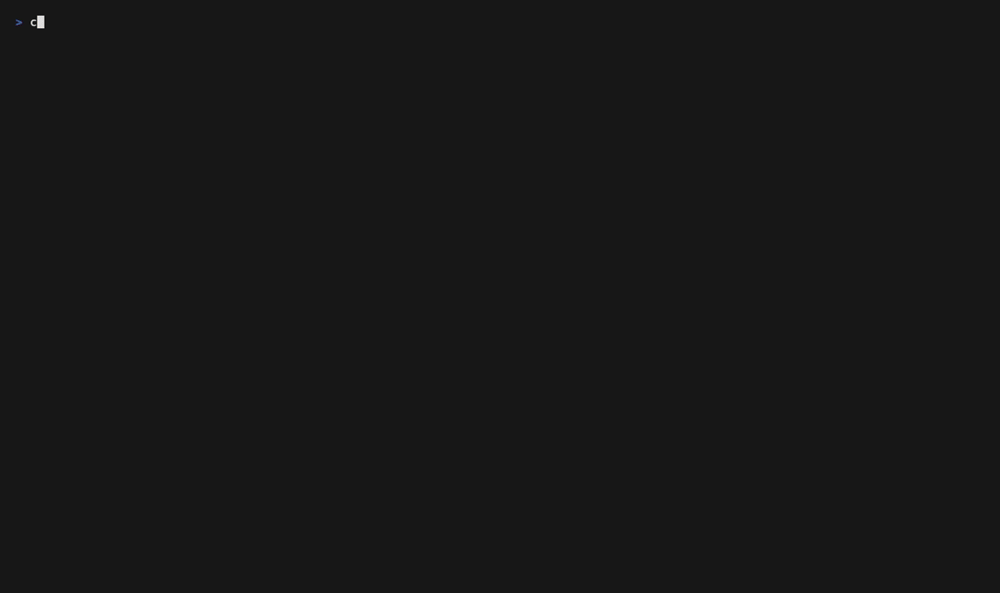

# Zest

Declarative, high-level TUI framework for Zig — comptime layouts, domain focus isolation, zero heap per frame.

> **Status: Pre-alpha. Active development. Not ready for production use.**

---

## What is Zest?

Zest is a TUI framework for Zig that lets you build rich terminal applications without writing layout math or touching terminal escape sequences. It sits above [`libvaxis`](https://github.com/rockorager/libvaxis) and handles everything between raw terminal I/O and your application logic.

The goal is to give Zig developers what Textual gives Python developers — a productive, expressive way to build terminal UIs. The entire screen structure is a single comptime blueprint tree: geometry, focus topology, and chrome are all declared in one place.

---

## Why Not Just Use libvaxis Directly?

libvaxis handles the hard parts at the bottom — terminal I/O, screen diffing, cell rendering. Zest handles the hard parts at the top: turning a declarative intent into correct pixel geometry and focus topology, every frame, with no boilerplate. The premise is that **screen structure is a type, not a calculation**.

libvaxis ships a higher-level layer called `vxfw` with `FlexColumn`, `FlexRow`, and `SplitView` widgets. Using those, the geometry for the demo is expressible without manual coordinate arithmetic. Here is what it looks like:

```zig
// Every widget is a mutable runtime struct — all must be kept alive for
// the duration of the frame. Widget identity is *anyopaque at every edge.
var header_text:   vxfw.Text = .{ .text = "zest demo" };
var files_text:    vxfw.Text = .{ .text = "1 files" };
var branches_text: vxfw.Text = .{ .text = "2 branches" };
var commits_text:  vxfw.Text = .{ .text = "3 commits" };
var stash_text:    vxfw.Text = .{ .text = "4 stash" };
var diff_text:     vxfw.Text = .{ .text = "0 diff" };
var cmdlog_text:   vxfw.Text = .{ .text = "command log" };
var footer_text:   vxfw.Text = .{ .text = "tab: cycle | ..." };

// SizedBox enforces fixed heights for chrome panes.
// .size is a vxfw.Size struct; omitting .width leaves it unconstrained.
var header_box: vxfw.SizedBox = .{ .size = .{ .height = 3 }, .child = header_text.widget() };
var cmdlog_box: vxfw.SizedBox = .{ .size = .{ .height = 5 }, .child = cmdlog_text.widget() };
var footer_box: vxfw.SizedBox = .{ .size = .{ .height = 1 }, .child = footer_text.widget() };

var sidebar: vxfw.FlexColumn = .{ .children = &.{
    .{ .widget = files_text.widget(),    .flex = 1 },
    .{ .widget = branches_text.widget(), .flex = 1 },
    .{ .widget = commits_text.widget(),  .flex = 1 },
    .{ .widget = stash_text.widget(),    .flex = 1 },
}};
var main_col: vxfw.FlexColumn = .{ .children = &.{
    .{ .widget = diff_text.widget(),  .flex = 1 },
    .{ .widget = cmdlog_box.widget(), .flex = 0 },
}};
// SplitView is horizontal-only and binary — one separator, two sides.
var body_split: vxfw.SplitView = .{
    .lhs = sidebar.widget(), .rhs = main_col.widget(), .width = 25,
};
var root: vxfw.FlexColumn = .{ .children = &.{
    .{ .widget = header_box.widget(), .flex = 0 },
    .{ .widget = body_split.widget(), .flex = 1 },
    .{ .widget = footer_box.widget(), .flex = 0 },
}};
```

This works. The geometry math is gone. But two problems remain that vxfw does not address.

**Focus topology is still entirely manual.** vxfw's `App` routes key events to whichever widget currently holds focus, but focus topology — which panels share a Tab ring, which domains are independent, which panes are non-focusable chrome — is the application's responsibility. After the layout above, you still write the same `SIDEBAR_COUNT` constant, the same per-panel boolean conditions, and the same four-site update when a pane is added.

**Panel identity is lost at every node.** The widget protocol is `*anyopaque` + function pointer at every boundary. There is no `p.sidebar`, no compile-time name validation, and `FlexColumn` heap-allocates a `Surface` and children list on every draw call.

The same layout in Zest is the single blueprint in the [Quick Start](#focus-domains) section below. The difference is not just fewer lines — it is a different level of abstraction.

**You describe intent, not computation.** `fraction = 1` replaces coordinate arithmetic, and the layout declaration and focus topology live in the same tree. Rename a pane — it's one word change; mistype it and the compiler tells you immediately.

**The schema is the program.** Adding a fifth sidebar pane is one new `pane()` line. Tab cycling, domain isolation, and focus stamping are all derived from that declaration — there is no parallel counter, no index to keep in sync, no extra branch to remember.

**Correctness is structural, not conventional.** `focusable = false` on a header or log strip is a compile-time fact. The compositor enforces it unconditionally. In vxfw and raw libvaxis alike, the invariant "this panel is never focused" is a convention — invisible to the compiler and easy to violate under refactoring.

### Structural changes stay local

This advantage compounds when you make changes. Say you want to split the command log into a raw log on the left and a detail view on the right.

In Zest, wrap the existing `pane` in a `vsplit` and add one child:

```zig
// Before — one line:
zest.pane(.{ .id = "cmdlog", .size = .{ .fixed = 5 }, .border = true, .focusable = false }),

// After — still one logical declaration:
zest.vsplit(.{
    .size     = .{ .fixed = 5 },
    .children = &.{
        zest.pane(.{ .id = "cmdlog", .size = .{ .fraction = 1 }, .border = true, .focusable = false }),
        zest.pane(.{ .id = "detail", .size = .{ .fixed = 30 },   .border = true, .focusable = false }),
    },
}),
```

`p.detail` appears in the result struct immediately. Forget to render it and the compiler tells you.

In vxfw, the same change touches four separate sites:

```zig
// Before — cmdlog is a SizedBox wrapping a single Text widget:
var cmdlog_box: vxfw.SizedBox = .{ .size = .{ .height = 5 }, .child = cmdlog_text.widget() };

// After — new Text, new SizedBox, new FlexRow, and main_col's children rewired.
var detail_text: vxfw.Text     = .{ .text = "detail" };
var detail_box:  vxfw.SizedBox = .{ .size = .{ .width = 30 }, .child = detail_text.widget() };
var cmdlog_row:  vxfw.FlexRow  = .{ .children = &.{
    .{ .widget = cmdlog_text.widget(), .flex = 1 },
    .{ .widget = detail_box.widget(),  .flex = 0 },
}};
var main_col: vxfw.FlexColumn = .{ .children = &.{
    .{ .widget = diff_text.widget(),  .flex = 1 },
    .{ .widget = cmdlog_row.widget(), .flex = 0 },  // ← was cmdlog_box
}};
```

And the focus bookkeeping is unchanged — because vxfw never touched it.

---

## Core Ideas

### Comptime Panel Layouts

Screen structure — which panels go where, which share a Tab focus ring, which are non-focusable chrome — is declared as a comptime blueprint tree and validated at compile time. The framework resolves panel positions from actual terminal dimensions at render time. No layout math. No coordinate arithmetic.

### Focus Domains

`domain()` nodes mark focus boundaries inside the blueprint. Tab cycling is constrained to the focusable panes within a single domain; focus never crosses domain boundaries automatically. Each domain gets its own `FocusStack`. Pressing a hotkey to jump between domains is explicit, deliberate, and stays within each column's own memory.

```zig
const layout = zest.vsplit(.{
    .children = &.{
        zest.domain(.{ .id = "sidebar", .direction = zest.Direction.vertical, .size = .{ .fixed = 25 }, .children = &.{ ... } }),
        zest.domain(.{ .id = "main",    .direction = zest.Direction.vertical, .size = .{ .fraction = 1 }, .children = &.{ ... } }),
    },
});
```

### Non-Focusable Chrome

Panes declared with `focusable = false` are excluded from Tab cycling and always report `focused = false`. Headers, footers, status bars, and log strips are declared inline — no null-focus plumbing needed.

### Widgets Own Their State

Widgets are structs with explicit state — scroll position, cursor, selection index. Application data is passed in at draw time. This keeps widgets reusable and keeps your data model in control.

### Themeable Styling

`Theme(C)` and `Style(C)` are generic over a caller-supplied color enum. The library ships an anonymous 23-slot built-in `Color` (16 ANSI palette + 6 universal UI roles: `background`, `foreground`, `cursor_color`, `cursor_text`, `selection_bg`, `selection_fg`) shaped to map 1:1 onto ghostty / kitty / alacritty theme files. Apps that want semantic role names — `chat_text`, `my_nick`, `diff_added` — define their own enum and a `Theme(MyColor)` value, and use it alongside the built-in palette in the same draw call.

`ByFocus(T)` and `ByState(E, T)` are small generic primitives for values that vary with a UI state. Declare once, pick at draw time:

```zig
const border: zest.ByFocus(zest.DefaultStyle) = .{
    .focused   = .{ .fg = .color_4 },
    .unfocused = .{ .fg = .color_8 },
};
const style = border.pick(panel.focused);
```

`Anchor` places content inside its window: `left/center/right` × `top/middle/bottom`. Widgets take it through a draw-time `opts.anchor` — `Text.draw` passes the call through `anchor.resolve` to position the text without manual offset math.

`Theme(C).noColor()` returns a theme where every role maps to terminal default — apps honour the [NO_COLOR convention](https://no-color.org) by checking the environment variable at startup and swapping themes. Text decorations (bold, italic, underline) still apply, per the spec.

### Viz Widgets

`ProgressBar(C)`, `Gauge(C)`, `Spinner(C)`, `Sparkline(C)`, and `TitleBar(C)` cover the common terminal-app indicators: determinate progress with optional label overlay, horizontal or vertical level meters with a top-row label, indeterminate loading with 8 built-in frame sets (braille, line, pulse, dots, arc, circle, triangle, block), historical data viz with sub-cell precision, and powerline-style title pills with optional NerdFont caps. All five are generic over a color enum and integrate with `Theme(C)`. `ProgressBar` and `Gauge` share a `subcell` discretisation helper that maps fractions to 1/8 block glyphs (▏▎▍▌▋▊▉ / ▁▂▃▄▅▆▇) with NaN-safe coercion at the boundary.

### Time-Driven Updates

`RunOpts.tick_interval` opts into a `.tick` event posted at a configurable cadence. A small worker on `std.Io.concurrent` posts ticks through the same event queue the terminal uses, so animations (progress, spinners) and polling (filesystem, network) reuse the existing update path. The worker is cancelled and joined before `run()` returns; shutdown latency is bounded by the time `std.Io.sleep` takes to observe cancellation, not by the tick interval itself.

### Custom Widgets

When the library doesn't ship the widget you need, write your own using the same conventions every built-in widget already follows: generic over a Color enum, visual identity on the struct, persistent state on the struct, `draw(self, win, [data,] theme, [opts])`, optional `handleKey(self, key, ...)`. See [`docs/custom-widgets.md`](docs/custom-widgets.md) for the protocol and `src/widgets/example_toggle.zig` for a minimal worked example.

### Enforced Update/Draw Separation

`update` mutates state; `draw` renders it. The framework passes a `vaxis.Window` only to `draw`, so rendering from inside `update` is a compile error, not a convention. This makes `update` testable without a terminal.

### Single-Threaded First

A straightforward single-threaded event loop: read event → update state → render. The optional tick worker is the only background thread; it produces events, it doesn't run application code. `update` and `draw` always execute on the main thread, so the testable-without-a-terminal property still holds.

### Zero Heap Per Frame

All memory allocated during a render pass lives in a frame-scoped arena that is reset at the start of each frame. No per-frame heap fragmentation. No GC pressure.

---

## Demo



---

## Quick Start

### Layout

Declare your screen structure once as a comptime blueprint. `vsplit` adds a vertical line (children sit left-to-right); `hsplit` adds a horizontal line (children stack top-to-bottom) — matching tmux/vim convention. `pane` is a leaf that becomes a rendered panel:

```zig
const layout = zest.vsplit(.{
    .children = &.{
        zest.pane(.{ .id = "sidebar", .size = .{ .fixed = 30 }, .border = true }),
        zest.hsplit(.{
            .size     = .{ .fraction = 1 },
            .children = &.{
                zest.pane(.{ .id = "header", .size = .{ .fixed = 3 },    .border = true }),
                zest.pane(.{ .id = "body",   .size = .{ .fraction = 1 }, .border = true }),
            },
        }),
    },
});
```

Call `Layout.panels()` each frame to get a named struct of panels — one field per pane:

```zig
const p = zest.Layout.panels(layout, win,
    .{ .x = 0, .y = 0, .width = win.width, .height = win.height }, .{});
_ = p.sidebar.win.print(&.{.{ .text = "Sidebar" }}, .{});
_ = p.header.win.print(&.{.{ .text = "Header"  }}, .{});
_ = p.body.win.print(&.{.{ .text = "Body"    }}, .{});
```

Renaming a pane — `"sidebar"` to `"nav"` — is a compile error, not a silent index mismatch:

```
error: no field named 'sidebar' in struct 'PanelsType(vsplit(.{ .children = &.{ ... } }))'
    _ = p.sidebar.win.print(...)
          ^~~~~~~
```

### Focus Domains

Wrap groups of panes in `domain()` nodes to create independent Tab rings. Each domain gets its own `FocusStack`; only the active domain's pane shows as focused:

```zig
const layout = zest.vsplit(.{
    .children = &.{
        zest.domain(.{
            .id        = "sidebar",
            .direction = zest.Direction.vertical,
            .size      = .{ .fixed = 25 },
            .children  = &.{
                zest.pane(.{ .id = "files",   .size = .{ .fraction = 1 }, .border = true }),
                zest.pane(.{ .id = "commits", .size = .{ .fraction = 1 }, .border = true }),
            },
        }),
        zest.domain(.{
            .id        = "main",
            .direction = zest.Direction.vertical,
            .size      = .{ .fraction = 1 },
            .children  = &.{
                zest.pane(.{ .id = "diff",   .size = .{ .fraction = 1 }, .border = true }),
                zest.pane(.{ .id = "status", .size = .{ .fixed = 3 },    .border = true, .focusable = false }),
            },
        }),
    },
});
```

`FocusStateType` generates the complete focus state for all domains in one call — one typed field per `domain()` node, plus `active_domain`. No per-domain declarations, no parallel counters:

```zig
const FocusState = zest.Layout.FocusStateType(layout);

const State = struct {
    focus: FocusState,
    // ... application data
};

fn activeFocus(state: *State) *zest.FocusStack {
    return zest.Layout.focusStateActiveFocus(layout, &state.focus);
}

// In main():
state.focus = zest.Layout.focusStateInit(layout);

// In draw() — panelsFromState reads active_domain off the focus state
// and stamps focused = true on the right pane in the right domain.
// No per-domain optional pointers; no boilerplate at the call site.
const p = zest.Layout.panelsFromState(layout, win,
    .{ .x = 0, .y = 0, .width = win.width, .height = win.height },
    &state.focus);
```

Domain switching and panel navigation use enum literals — no strings, no integers, no index arithmetic:

```zig
state.focus.active_domain = .main;         // switch active domain
state.focus.sidebar.set(.commits);         // jump to named panel
if (state.focus.sidebar.is(.files)) { ... } // check named panel focus
```

### Event Loop

`update` mutates state and signals whether a redraw is needed. It never renders — no window is passed, so rendering from `update` is impossible by construction. `draw` receives the root window and renders the current state; the framework calls it only when `update` returns `.redraw`.

```zig
fn update(state: *State, event: zest.Event, alloc: std.mem.Allocator) zest.UpdateResult {
    switch (event) {
        .key_press => |key| {
            if (key.matches('q', .{})) return .quit;
            if (key.matches('w', .{ .ctrl = true })) {
                state.focus.active_domain =
                    if (state.focus.active_domain == .sidebar) .main else .sidebar;
            }
            return .redraw;
        },
        .winsize, .focus_changed => return .redraw,
        else => return .idle,
    }
}

fn draw(state: *State, win: vaxis.Window) void {
    win.clear();
    const p = zest.Layout.panelsFromState(layout, win,
        .{ .x = 0, .y = 0, .width = win.width, .height = win.height },
        &state.focus);
    // render p.files.win, p.diff.win, etc.
}

// Wire everything together — Tab cycling, state mutation, and rendering
// are separate callbacks; the framework composes them. The trailing
// RunOpts carries opt-in features; pass `.{}` for none, or
// `.{ .tick_interval = .fromMilliseconds(100) }` to receive .tick events
// for animation and polling.
try app.run(&state, activeFocus, update, draw, .{});
```

See [`src/main.zig`](src/main.zig) for the complete demo.

---

## Roadmap

| Milestone | Scope | Status |
|---|---|---|
| 1 — Foundation | libvaxis wiring, event loop, frame arena, resize handling | ✅ Complete |
| 2 — Layout Engine | Layout types, recursive solver, Layout compositor, named panels | ✅ Complete |
| 3 — Focus System | FocusStack, Tab cycling, domain focus isolation, non-focusable chrome | ✅ Complete |
| 4 — Core Widgets & Styling | `Text` (with `Anchor` placement), `List(C)`, `Theme(C)` / `Style(C)` / `WidgetTheme(C)`, `ByFocus(T)` / `ByState(E, T)`, Catppuccin presets | ✅ Complete |
| 5 — Viz Widgets | `ProgressBar(C)`, `Gauge(C)`, `Spinner(C)`, `Sparkline(C)`, `TitleBar(C)`, sub-cell discretisation, `.tick` event + `RunOpts.tick_interval`, `Theme(C).noColor()` | ✅ Complete |
| 6 — Table & Custom Widgets | `Table(C)` with column sizing, alignment, scroll, zebra stripes; custom widget protocol documented in `docs/custom-widgets.md` with a worked example | ✅ Complete |
| 7 — Release | Dashboard example, benchmark harness, docs, v0.1.0 | 🔲 Planned |

---

## Performance Targets

| Metric | Target |
|---|---|
| Resident Set Size (RSS) | < 12 MB |
| Frame layout latency (p99) | < 150 µs |
| Release binary size | < 4 MB |

Targets measured with `heaptrack` and `std.time.Timer` against the dashboard example (Milestone 6), built with `ReleaseSmall`.

---

## Dependencies

- [Zig](https://ziglang.org/) — pinned version specified in `build.zig.zon`
- [libvaxis](https://github.com/rockorager/libvaxis) — terminal I/O, screen diffing, cell rendering

No other runtime dependencies.

---

## What's Out of Scope for v0.1

- Multi-threaded application code (the tick worker is internal-only)
- Complex animation systems (keyframes, easing curves) — the `.tick` event covers simple cases
- Windows / ConPTY support (Linux and macOS only)
- Kitty graphics protocol (planned for v0.2)
- Accessibility beyond NO_COLOR (screen-reader support, high-contrast modes)

---

## License

MIT — see [LICENSE](LICENSE).
